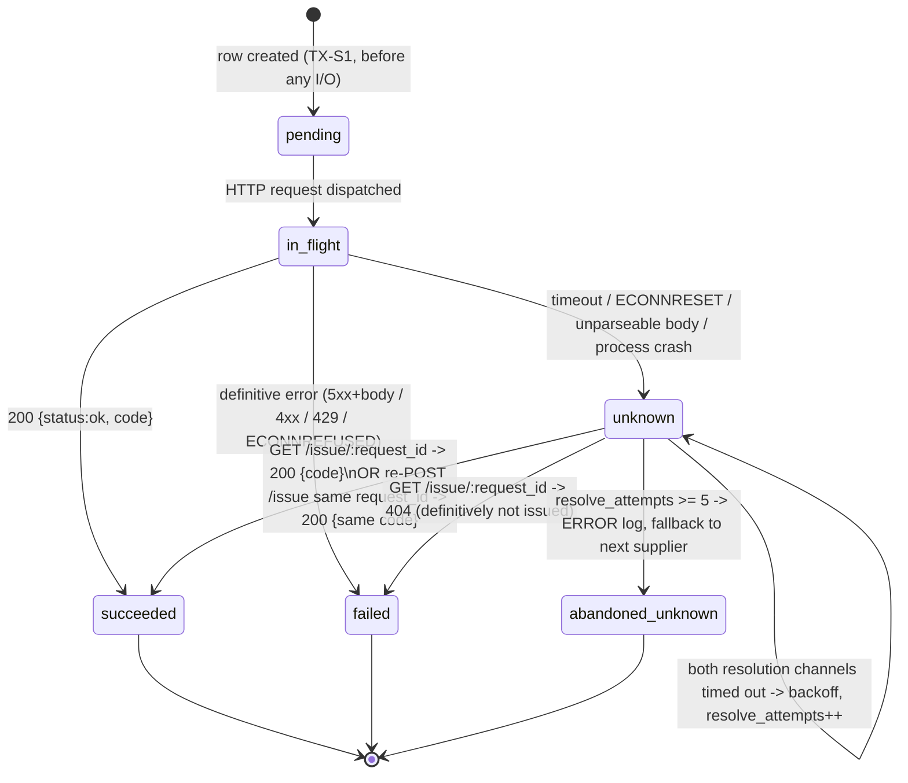

## 6. Supplier integration and the timeout trap (stage 3)

### 6.0 Inventory model — the decision

**Two fulfilment modes, one pipeline.** `products.fulfillment_mode`:

- `pool` — the code comes from **our** `stock_keys` table, seeded from `stock/keys.json`. Applies to `type='key'` SKUs (3 of the 12: `KEY-CS2-PRIME`, `KEY-GTA5`, `KEY-EFT`). This is the classic "we bought keys in advance" case.
- `supplier` — the code is **minted on demand** by supplier A (fallback B) via `POST /issue`. Applies to `topup`/`subscription`/`giftcard` (9 of the 12). This is the drop-ship case.

The CHECK constraint `(type = 'key') = (fulfillment_mode = 'pool')` makes the mapping structural, not conventional.

Rejected alternatives:
- *Everything through suppliers* — makes the local key pool and its "one key never to two orders" note meaningless, and leaves the stage-5 stock counter with nothing local to count or repair.
- *Everything from the local pool* — makes the supplier stubs decorative and the timeout trap fake, since we would reserve the key ourselves before ever calling out.

The two modes share **everything** except one step ("obtain a code"): the same job, the same order lock, the same `issued_deliveries` insert, the same ledger posting, the same recovery. The split is a strategy selection inside `DeliveryService`, not a second pipeline.

**"One key can never go to two orders" is guaranteed by:** `stock_keys_order_uq` (a key row's `order_id` is unique), the reservation being an atomic `UPDATE ... WHERE id = (SELECT ... FOR UPDATE SKIP LOCKED LIMIT 1)`, `issued_deliveries_stock_key_uq`, and — for both modes — `issued_deliveries_order_uq` and the global `issued_deliveries_code_uq`.

### 6.1 The supplier client

`suppliers/supplier-client.service.ts`, built on global `fetch` (Node 22 core undici) — no HTTP library.

```ts
issue(supplier: SupplierCode, body: IIssueRequest): Promise<ISupplierOutcome>;
lookup(supplier: SupplierCode, requestId: string): Promise<ISupplierOutcome>;
```

- **Per-request timeout budget:** `AbortSignal.timeout(SUPPLIER_REQUEST_TIMEOUT_MS)`, default **2000 ms**. Applied to the whole request/response cycle. The stub's `slow` mode uses 500–1500 ms (under budget, must succeed); `timeout`/`issue_then_hang` modes hang for `SUPPLIER_REQUEST_TIMEOUT_MS * 3` (well over budget, must abort).
- **Response parsing:** body is read as text, then `JSON.parse` inside try/catch. A non-JSON body on a 5xx is a *different* outcome from a well-formed `{"status":"error","reason":...}` — see the classification table.
- **Header:** `x-request-id` = correlation trace id, for cross-service log stitching. No test-only headers in production code.

**Error classification** (`SUPPLIER_ERROR_KIND` in `suppliers.constants.ts`) — this table is the heart of stage 3:

| Observation | `error_kind` | Could the supplier have issued? | Attempt state | Next action |
|---|---|---|---|---|
| `200` + `{"status":"ok", code}` | — | yes, and we know the code | `succeeded` | finalise |
| `AbortError` (timeout) | `timeout` | **YES — unknown** | `unknown` | resolve loop, same `request_id` |
| `ECONNRESET` / socket hang up mid-request | `network_reset` | **YES — unknown** | `unknown` | resolve loop, same `request_id` |
| `ECONNREFUSED` / `ENOTFOUND` / `EAI_AGAIN` | `network_refused` | **NO** — TCP never established | `failed` | immediate fallback to the next supplier |
| `4xx` + `{"status":"error","reason":"out_of_stock"}` | `out_of_stock` | no | `failed` | try next supplier; if none left → order `out_of_stock` |
| `4xx` + any other well-formed error body | `bad_request` | no | `failed` | no same-supplier retry; fallback |
| `5xx` + well-formed `{"status":"error","reason":...}` | `server_error` | no — the supplier told us it failed | `failed` | retry same supplier (new `attempt_no`) up to budget, then fallback |
| `429` | `rate_limited` | no | `failed` | retry same supplier after backoff |
| `5xx` with empty/unparseable body, or `200` with a body that fails schema validation | `unknown_response` | **YES — unknown** | `unknown` | resolve loop, same `request_id` |

The distinction between `server_error` (structured error body ⇒ definitively not issued) and `unknown_response` (garbage ⇒ possibly issued) is the point where a lazier design would create a double issuance.

**Retry policy — two levels, deliberately:**

| Level | Where | Attempts | Backoff |
|---|---|---|---|
| In-job, same supplier, *new* `attempt_no` | `SupplierFulfilmentService` | `SUPPLIER_MAX_ATTEMPTS_PER_SUPPLIER` = **2** | `nextDelayMs(n, 200, 2000)` |
| In-job, same supplier, **same** `attempt_no` and `request_id` (unknown resolution) | `AttemptResolverService` | `SUPPLIER_UNKNOWN_MAX_RESOLVE_ATTEMPTS` = **5** | `nextDelayMs(n, 500, 30000)`, persisted in `next_resolve_at` |
| Job level (whole delivery re-run) | `JobQueueService` | `jobs.max_attempts` = **8** | `nextDelayMs(attempts, 500, 30000)`, persisted in `run_at` |

The job is bounded by `SUPPLIER_JOB_BUDGET_MS` (10 000): once elapsed, the handler stops issuing new calls, persists everything, and reschedules the job. This keeps one poisoned order from monopolising a worker slot.

**Backoff formula** (`suppliers/backoff.util.ts`, unit-tested):

```ts
export function nextDelayMs(attempt: number, baseMs: number, maxMs: number, rnd = Math.random): number {
  const exp = Math.min(maxMs, baseMs * 2 ** Math.max(0, attempt - 1));

  return Math.floor(exp / 2 + rnd() * (exp / 2));
}
// attempt 1 -> [250,500), 2 -> [500,1000), 3 -> [1000,2000) ... capped at [15000,30000)
```

Rejected "full jitter" (`rnd() * exp`): it can return ~0 ms, which under a wide fan-out reproduces the thundering herd it is meant to prevent.

**Circuit breaker: out of scope, deliberately.** With exactly two suppliers and a job queue that already applies persistent exponential backoff **per order**, a breaker adds shared mutable state, a half-open probing policy, and a new failure mode (a stuck-open breaker starving healthy traffic) without changing any acceptance criterion. The `network_refused` fast-path already gives instant fallback with zero wasted latency, which is the only thing a breaker would buy here. Stated in README §6.

### 6.2 Record-before-call

**Nothing is ever sent to a supplier before a durable row describing that call exists.**

```
TX-S1  INSERT INTO delivery_attempts
         (order_id, supplier_code, attempt_no, request_id, sku, state, started_at)
       VALUES ($1,$2,$3, buildRequestId(ext,$2,$3), $4, 'in_flight', now())
       -- guarded by delivery_attempts_open_uq: only one live attempt per order
COMMIT
---- HTTP POST /issue (no transaction held) ----
TX-S2  SELECT * FROM delivery_attempts WHERE id=$1 FOR UPDATE;
       UPDATE ... SET state=<succeeded|failed|unknown>, http_status, response_code,
                      error_kind, error_reason, finished_at=now(), duration_ms=$n,
                      next_resolve_at = CASE WHEN state='unknown' THEN now() + <backoff> END
COMMIT
```

If the process is killed at any point after TX-S1 — mid-flight, after the supplier issued, before TX-S2 — the row survives in `in_flight`. The sweeper picks up `in_flight` attempts older than `ATTEMPT_INFLIGHT_TIMEOUT_MS` (30 000), demotes them to `unknown` and schedules resolution. **Crash and timeout converge on the same recovery path**, which is why there is only one recovery mechanism to reason about.

### 6.3 `request_id` derivation (acceptance criterion 4)

```ts
// apps/api/src/suppliers/request-id.util.ts
export function buildRequestId(
  orderExtId: string,       // 'ord_00123'
  supplier: SupplierCode,   // 'A' | 'B'
  attemptNo: number,        // 1-based, per (order, supplier)
): string {
  return `req_${orderExtId}_${supplier}_${attemptNo}`;
}
// buildRequestId('ord_00123', 'A', 1) === 'req_ord_00123_A_1'
```

Properties:
- **Deterministic** — a pure function of three persisted values. Recomputable from `orders` + `delivery_attempts` at any time, from any process.
- **Durable** — persisted in `delivery_attempts.request_id` with `UNIQUE`, before the call. Determinism alone is not enough: we also need to know an attempt is outstanding, and only a row can tell us that.
- **Collision-free by construction** — `UNIQUE (order_id, supplier_code, attempt_no)` and `UNIQUE (request_id)` are mutually reinforcing.

**The rule that makes criterion 4 pass, stated as loudly as possible:**

> **A timeout, a socket reset, an unparseable response or a process crash NEVER advances `attempt_no` and NEVER creates a new `delivery_attempts` row. The retry re-sends the SAME `request_id` on the SAME row.** `attempt_no` advances only on a *definitive* failure (`server_error`, `rate_limited`, `bad_request`, `out_of_stock`, `network_refused`) — i.e. only when we have positive evidence that no code was issued.

Rejected alternative: a random UUID per HTTP call — the supplier's `request_id -> code` map would then be useless and every timeout would mint a second code.

### 6.4 A → B fallback (acceptance criterion 5)

`FALLBACK_CHAIN = ['A', 'B'] as const` in `suppliers.constants.ts`.

We move from A to B **only when A's attempt is in a state that provably did not issue a code**:

| A's outcome | Move to B? |
|---|---|
| `network_refused` (A is down / port closed / container stopped) | **Yes, immediately**, no backoff — this is the criterion-5 fast path |
| `server_error` / `rate_limited`, after `SUPPLIER_MAX_ATTEMPTS_PER_SUPPLIER` exhausted | Yes |
| `bad_request` | Yes, immediately (retrying a rejected request is pointless) |
| `out_of_stock` | Yes (B may hold stock); if B is also `out_of_stock` → order → `out_of_stock` |
| `unknown` (timeout / reset / garbage) | **NO.** Must be resolved first — see §6.5 |
| `succeeded` | No, obviously |

**B receives a DIFFERENT `request_id`:** `req_ord_00123_B_1`. Justification: the `request_id` namespace is **per supplier**. B has never seen A's id and cannot honour "same id → same code" for it; sending A's id to B would either collide meaninglessly in B's map or be rejected. The contract's idempotency guarantee is scoped to one supplier's store, so the id must be scoped the same way. `supplier_code` is baked into the id precisely to make this scoping visible in logs.

Residual risk we accept and surface (rather than hide): if A did issue a code but we never learn it, that code is stranded upstream. It is recorded as `delivery_attempts.state='abandoned_unknown'`, logged at ERROR as `delivery.stranded_issuance`, and reported by `GET /reconciliation/stranded-issuances` for a manual credit-back with the supplier. **The customer is still delivered exactly once** — `issued_deliveries_order_uq` sees to that. This is the honest trade-off: we never risk double-delivering to a customer, and we make the (rare) upstream over-purchase auditable.

### 6.5 The `unknown` state and how it is resolved



**Resolution procedure** (`delivery/attempt-resolver.service.ts`, driven by the `resolve_unknown_attempt` job):

1. **Channel 1 — `GET /issue/:request_id`** on the *same* supplier.
   - `200 {status:"ok", code}` → the supplier DID issue. Attempt → `succeeded` with that `code`. Proceed to TX-S3 finalisation. **This is exactly criterion 4.**
   - `404 {status:"error", reason:"not_found"}` → the supplier definitively did **not** issue. Attempt → `failed(error_kind='timeout_not_issued')`. Safe to retry the same supplier with a new `attempt_no`, or to fall back to B.
   - timeout / 5xx → fall through to channel 2.
2. **Channel 2 — re-`POST /issue` with the SAME `request_id`.** By contract this is idempotent: if the supplier issued, it returns the same code; if it did not, it issues now and returns the code. Either way the outcome is a single code for that `request_id`.
   - `200` → `succeeded`.
   - timeout again → `resolve_attempts++`, `next_resolve_at = now() + nextDelayMs(resolve_attempts, 500, 30000)`, state stays `unknown`, job rescheduled.
3. After `SUPPLIER_UNKNOWN_MAX_RESOLVE_ATTEMPTS` (5) the attempt becomes `abandoned_unknown`, ERROR log `delivery.stranded_issuance`, and the delivery moves to the next supplier in the chain.

**Why this cannot double-issue:** every channel uses the same `request_id`, so the supplier can only ever return one code for it; and our own finalisation (`INSERT INTO issued_deliveries ... ON CONFLICT (order_id) DO NOTHING`) can only ever produce one delivery fact, so even a code obtained twice from two channels lands once.

### 6.6 The supplier stub's contract implementation

Two instances of `apps/supplier-stub` (`SUPPLIER_ID=A|B`), NestJS — already in the dependency budget, no extra deps.

**Storage — `issue-store.service.ts`:** in-memory `Map<string, IIssueRecord>` keyed by `request_id`, where `IIssueRecord = { requestId, sku, orderId, code, issuedAt }`. Write-through to `STUB_PERSIST_PATH` (default `./.stub-state-${SUPPLIER_ID}.json`) via `node:fs.writeFileSync` on every mutation; loaded on boot. Persistence matters: it makes `docker compose stop supplier-a && docker compose start supplier-a` followed by a retry with the same `request_id` return the same code — the exact behaviour criterion 4 probes.

**Code generation — `code-generator.util.ts`:** `XXXX-XXXX-XXXX` over alphabet `ABCDEFGHIJKLMNOPQRSTUVWXYZ0123456789` from `crypto.randomBytes` (Node built-in), prefixed per supplier so logs are unambiguous: A mints `A`-seeded codes, B mints `B`-seeded ones. Uniqueness is checked against the store; collisions regenerate.

**Endpoints:**

| Method | Path | Behaviour |
|---|---|---|
| `POST` | `/issue` | Contract. Body `{request_id, sku, order_id}`. **If `request_id` is already in the store → return the stored record verbatim, 200, without consuming inventory and without applying any scenario.** This precedence rule is the contract's core guarantee and must be the very first branch in the handler. |
| `GET` | `/issue/:requestId` | `200 {status:"ok", request_id, code}` if known; `404 {status:"error", reason:"not_found"}` otherwise. **Never applies a scenario and never mints.** Pure lookup — the primary `unknown`-resolution channel. |
| `GET` | `/inventory` | `{supplier_id, available, issued}` — used by the reconciliation report and the demo scripts. |
| `POST` | `/_control/scenario` | `{mode, times?}` — force the next `times` (default 1) *new* issuances into `mode`. Returns the queue depth. |
| `POST` | `/_control/restock` | `{count}` — sets/increments `available`. |
| `POST` | `/_control/reset` | Clears the store, the forced-scenario queue and restores `available` to `STUB_INVENTORY_SIZE`. Called between tests. |
| `GET` | `/_control/state` | `{supplier_id, available, issued_count, forced_queue, records:[{request_id, order_id, code}]}` — tests assert **on the stub's own view** that exactly one code was minted for the order. |
| `GET` | `/health` | liveness |

**Scenario modes** (`STUB_MODE` in `stub.constants.ts`):

| Mode | Effect | Consumes inventory? | Did it issue? |
|---|---|---|---|
| `normal` | Random draw from the env-configured rates | — | — |
| `ok` | Mint + return 200 immediately | yes | yes |
| `slow` | Sleep `STUB_LATENCY_MS_MIN..MAX` (default 500–1500, under the client's 2000 ms budget), then mint + 200 | yes | yes |
| `timeout` | Sleep `STUB_HANG_MS` (default 6000) and return 200 **without minting** | no | **no** |
| `issue_then_hang` | **Mint and persist the record FIRST**, then sleep `STUB_HANG_MS`, then return 200 | yes | **yes** — this is the timeout trap |
| `error_5xx` | `503 {status:"error", reason:"upstream_unavailable"}` | no | no |
| `error_5xx_garbage` | `502` with body `"<html>bad gateway</html>"` | no | no (but the client must classify it `unknown_response`) |
| `out_of_stock` | `409 {status:"error", reason:"out_of_stock"}` | no | no |
| `bad_request` | `400 {status:"error", reason:"sku_unknown"}` | no | no |
| `refuse` | Destroy the TCP socket in the `connection` handler before reading the request | no | no |

**Random mode (`normal`) rates**, per instance: `STUB_FAIL_RATE` (0.0–1.0), `STUB_TIMEOUT_RATE`, `STUB_SLOW_RATE`. Draw order: timeout → fail → slow → ok. Defaults differ per instance so `docker compose up` alone already produces interesting behaviour: A = `0.2/0.2/0.3`, B = `0.1/0.05/0.2`. In CI and integration tests all rates are `0` — **randomness is never the source of test determinism.**

**Forced determinism for tests — the control API is the only mechanism.** No magic headers, no magic SKUs, nothing test-specific in the production supplier client. A test calls the stub directly:

```
POST http://<stubA>/_control/reset
POST http://<stubA>/_control/scenario {"mode":"issue_then_hang","times":1}
```

and then drives the normal application flow. Rejected alternative: a `x-stub-scenario` header forwarded by our client — it would put test-only branching into production code and would not survive the `GET /issue/:request_id` resolution path (which must not apply scenarios at all).

For criterion 5, the deterministic "supplier A unavailable" is produced **not** by a stub mode but by pointing `SUPPLIER_A_BASE_URL` at a closed loopback port (`http://127.0.0.1:59999`) in that test's app instance — a real `ECONNREFUSED` with zero moving parts. The `refuse` mode and `docker compose stop supplier-a` exist for the manual/README demo.

**Inventory:** `STUB_INVENTORY_SIZE` (default 100) per instance. Each successful mint decrements it; at `0` every new `request_id` gets `409 out_of_stock` while already-known `request_id`s still return their stored code. This gives the supplier path a genuine `out_of_stock` branch.

### 6.7 Key-pool interaction and the `out_of_stock` path (criterion 6)

Restating §6.0 concretely, because this is the question most likely to be asked at review:

> **Suppliers do not draw from our pool, and our pool is not a mirror of theirs.** They are two disjoint fulfilment channels selected per product by `products.fulfillment_mode`, constrained by `(type = 'key') = (fulfillment_mode = 'pool')`.
>
> - **`pool`** — the 3 `type='key'` SKUs. Codes come from `stock_keys`, seeded from `stock/keys.json` (50 keys, distributed 20/20/10). Reservation is `UPDATE ... WHERE id = (SELECT id ... FOR UPDATE SKIP LOCKED LIMIT 1)`. `SKIP LOCKED` means two concurrent deliveries for the same SKU never contend and never pick the same row.
> - **`supplier`** — the other 9 SKUs. Codes are minted by A (fallback B). `sku_stock.available_count` for these is our local view of supplier availability.
>
> **"Один ключ не может уйти в два заказа"** is guaranteed at four independent levels: the atomic `SKIP LOCKED` reservation; `stock_keys_order_uq`; `issued_deliveries_stock_key_uq`; and the umbrella `issued_deliveries_order_uq` + `issued_deliveries_code_uq`.

**Reservation SQL** (`inventory/stock.repository.ts`, inside TX-P):

```sql
UPDATE stock_keys k
SET status = 'reserved', order_id = $2, reserved_at = now()
WHERE k.id = (
  SELECT id FROM stock_keys
  WHERE product_id = $1 AND status = 'available'
  ORDER BY id
  FOR UPDATE SKIP LOCKED
  LIMIT 1
)
RETURNING k.id, k.code;
```

Zero rows → no stock. **Idempotent re-entry:** before reserving, the delivery checks `SELECT id, code FROM stock_keys WHERE order_id = $2 AND status IN ('reserved','issued')`; if a key is already held by this order (a crash between reservation and finalisation), it is reused rather than a second one being taken.

**`out_of_stock` handling — recoverable, never a crash:**

- Pool mode, zero rows returned → `DELIVERY_OUT_OF_STOCK` → order `out_of_stock`, `failure_reason='out_of_stock'`, `sku_stock.available_count` forced to `0`, `products.in_stock=false`, INFO log `delivery.out_of_stock`. The job is marked `done` (not `dead`) — this is an expected business outcome, not a failure, so it must not burn the retry budget.
- Supplier mode, both A and B answer `out_of_stock` → identical treatment, plus `sku_stock.available_count = 0`.
- `GET /orders/:id` keeps returning `200` with `status: "out_of_stock"` and a `recoverable: true` flag. **No 5xx anywhere on this path.**

**Recovery:**
- `POST /admin/products/:sku/restock` — pool mode: `{codes: string[]}` or `{count: n}` (generated codes); inserts into `stock_keys` and bumps `sku_stock`/`products.in_stock` in one transaction. Supplier mode: sets `available_count` and calls the stub's `/_control/restock`.
- The sweeper (§7.3 pass 3) then finds `out_of_stock` orders whose product has `available_count > 0` and enqueues `deliver_order` with `delivery_generation + 1`. The customer needs no action.

---

